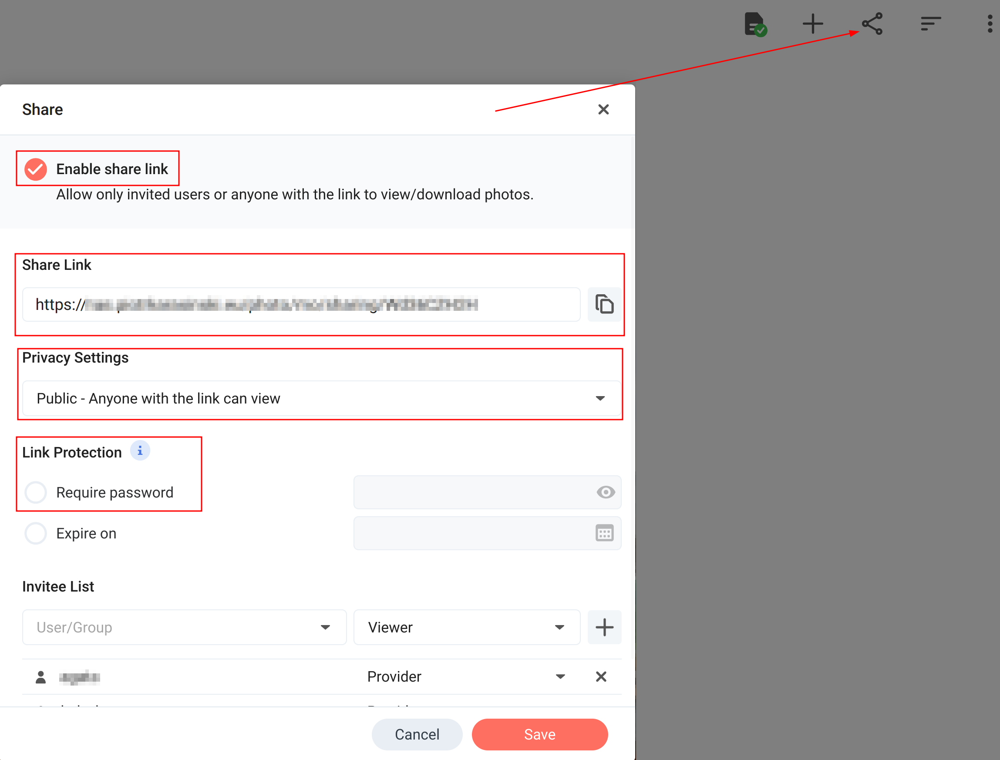

# synology-photos-slideshow

[Synology
Photos](https://www.synology.com/en-global/dsm/feature/photos) album
full-screen slideshow for Raspberry Pi.


## What?

I wrote this code for a DIY digital photo frame project using
Raspberry Pi connected to a monitor (runs great on Pi Zero 2). The
goal was to fetch photos directly from my Synology NAS over LAN.

Why not use Synology Photos browser client directly? There are two
reasons. First, current version of Synology Photos (1.3.3 at the time
of writing) does not allow slideshow speed adjustments, and changes
photo every 3 or 4 seconds - way too fast for a photo frame. Second,
running a full www browser is much more resource demanding than a
simple Python app, which matters when using Raspberry Pi, especially
in its Zero variant.


### Security Disclaimer

Since I am running all of this over local area network at home only,
security is not a priority for me. You should take extra steps which
are out of scope of this guide if you plan to access your NAS over
Internet, or if you're running this setup in an un-trusted LAN
(e.g. in an office or a dorm).


## Synology Photos Setup

1. Create an album in Synology Photos and add photos to it
2. Click "Share" icon in the Album
3. Check "Enable share link" option
4. Set Privacy Settings to "Public - Anyone with the link can view"
5. Do NOT enable Link Protection - support for password protection
   might get implemented in the future, for now the assumption is that
   the NAS and Pi are on the same *private* LAN.
7. Copy the Share Link somewhere - you'll need it when running the
   slideshow app on Raspberry Pi
6. Click Save




## Raspberry Pi Setup

The assumption is that you are starting with a fresh installation of
Raspberry Pi OS Lite, network has been set up (so you can access the
NAS) and you have command line access to the Pi.


### 1. Install Dependencies

Update the system and install the OS packages needed to run minimal X
server:

```
sudo -- sh -c ' \
apt update && \
apt upgrade -y && \
apt install -y \
	xserver-xorg \
	x11-xserver-utils \
	xinit \
	python3-tk \
	python3-venv \
	menu \
	git'
```

Python3-TK is used by the app to display images, while python3-venv is
needed to build the source code into a stand-alone executable. Git is
optional, and only needed if you'll be cloning the repository. Menu is
also optional and is there to avoid some errors being written to
`~/.xsession-errors`.


### 2. Build and Test

Clone the repository using `git glone`, or download the source code
zip and extract e.g. to `/home/pi/synology-photos-slideshow`.

`cd` into the directory and run

```
./build_pex.sh
```

Wait for the build to finish. A new file
`synology-photos-slideshow.pex` has been created.

Display help message:
```
./synology-photos-slideshow.pex
```

Run the app in X server:
```
sudo xinit /home/pi/synology-photos-slideshow/synology-photos-slideshow.pex {sharing link to Synology Photos album}
```

If everything works as expected, press Ctrl-Alt-1 to get back to the
console and Ctrl-C to kill the X server.


### 3. Run

For proper long-term usage, disabling screen saver, mouse cursor
etc. is desired. Create a startup script file, e.g
`/home/pi/startSlideshow.sh` with the following contents (replace
`SHARING_LINK` with link to your album, and optionally adjust the
photo-change-interval, here set to 30 seconds):

```
#!/bin/sh

# Disable any form of screen saver / screen blanking / power management
xset s off
xset s noblank
xset -dpms

# Allow quitting the X server with Ctrl-Alt-Backspace
setxkbmap -option terminate:ctrl_alt_bksp

# Start Synology Photos slideshow app
/home/pi/synology-photos-slideshow/synology-photos-slideshow.pex "SHARING_LINK" 30 > /tmp/synology-photos-slideshow.log 2>&1
```

The output of the program will be written to
`/tmp/synology-photos-slideshow.log` file.

Try it out with
```
sudo xinit /home/pi/startSlideshow.sh
```

Disclaimer: the script is adjusted from one of the many tutorials
available online about setting Raspberry Pi in kiosk mode,
unfortunately I can no longer find the specific site to give the
authors credit they deserve :(.


## Optional Stuff

### Auto-start

To start the slideshow automatically when Pi gets booted, enable
auto-login using `raspi-config` and add the following line to
`/etc/rc.local` just before `exit 0` (assuming you created the script
file as described above):

```
sudo xinit /home/pi/startSlideshow.sh &
```


### Startup-Shutdown Schedule

A proper digital photo frame doesn't run 24/7. Shutdown can be
scheduled in software only, but for startup you'll need a hardware
solution, e.g. for Raspberry Pi Zero I'm using [Witty Pi 3
Mini](https://www.adafruit.com/product/5038).


### Auto Brightness

For my digital photo frame project I attached a light sensor to Pi's
GPIO to adjust monitor's brightness automatically depending on ambient
light. [TSL2591](https://www.adafruit.com/product/1980) is an example
of such sensor - it is fairly easy to write a Python script that
executes `ddcutil` (package available in Raspbian OS) to set monitor's
brightness. I am planning to make the code available and describe the
setup in the future.
